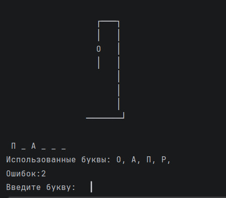
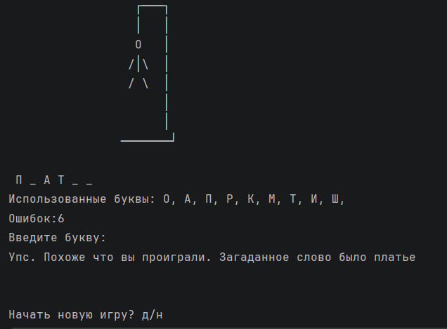
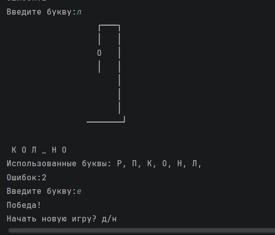
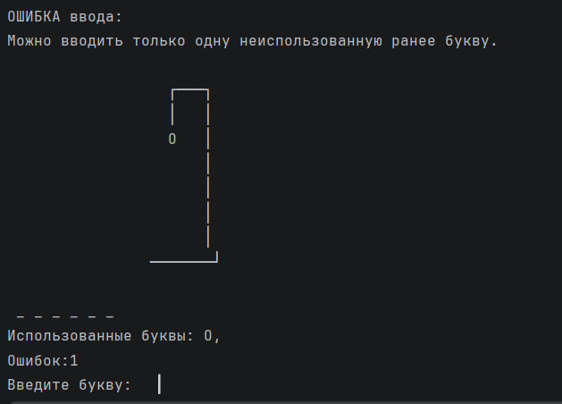

# Проект "Виселица" (Hangman)

Консольная реализация классической игры в слова "Виселица" на языке Python. Проект выполнен в качестве практического задания для закрепления базового синтаксиса и перехода от решения изолированных задач к написанию цельных приложений.

---

## Скриншоты игрового процесса

### Процесс игры

### Поражение в игре

### Победа в игре

### Обработка ошибок ввода

---

## Архитектура и заметки по реализации
* Словать загружается из текстового файла.
* Реализован отказоустойчивый ввод (валидация на ввод только одной буквы, проверку повторов, корректность символов и т.д.).
* Отрисовка виселицы разделена на 6 этапов (по количеству доступных ошибок).

---

## Стек технологий

* **Язык:** Java 26
* **Стиль реализации:** ООП 
